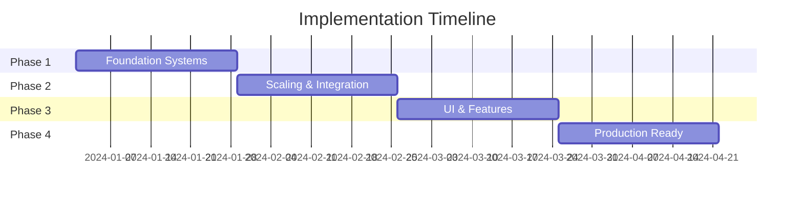

# The Sovereign's Dilemma - Implementation Plan
**Project**: Dutch Political Simulation Game
**Duration**: 16 Weeks (4 Phases)
**Start Date**: TBD (Pending Unity Setup)
**Status**: 📋 Pre-Implementation

## 📚 Reference Documentation

### Core Specifications
- [Comprehensive Implementation Roadmap](planning/comprehensive-implementation-roadmap.md) - Multi-persona expert analysis
- [Implementation Workflow](planning/implementation-workflow.md) - Detailed 48-week timeline
- [Performance Requirements](planning/performance-requirements.md) - ISO/IEC/IEEE 29148:2018 compliant specs
- [Bounded Context Architecture](planning/bounded-context-architecture.md) - Martin Fowler's DDD principles
- [Error Handling & Resilience](planning/error-handling-resilience.md) - Polly v8 patterns
- [Production Readiness Patterns](planning/production-readiness-patterns.md) - Operational excellence
- [Monitoring & Observability](planning/monitoring-observability-spec.md) - OpenTelemetry + SRE practices

### Research & Validation
- [Unity Tech Stack Verification](planning/research/unity-tech-stack-verification.md) - Unity 6.0 LTS validation
- [NVIDIA NIM Integration Analysis](planning/research/nvidia-nim-integration-analysis.md) - API capabilities
- [UI Framework Research](planning/research/ui-framework-research.md) - UGUI vs UI Toolkit analysis

### Security & DevOps
- [Security Architecture](security-architecture.md) - Cross-platform security framework
- [DevOps Documentation](devops/documentation/DEVOPS_STRATEGY.md) - CI/CD and deployment
- [Incident Response Plan](devops/documentation/INCIDENT_RESPONSE.md) - 24/7 response procedures

## 🎯 Project Goals

Build a Unity 6.0 LTS political simulation game featuring:
- 10,000+ AI-driven voter simulation at 60 FPS
- Real-time Dutch political dynamics with NVIDIA NIM integration
- Cross-platform deployment (Windows, macOS, Linux)
- User-configurable AI services with offline mode support
- GDPR-compliant security and data protection

## 📊 Current Status

### ✅ Completed
- All technical specifications (2,852 lines)
- Architecture design (Bounded Context DDD)
- Performance requirements (ISO/IEC/IEEE 29148:2018)
- Security framework design
- DevOps strategy and CI/CD planning

### 🔴 Critical Blockers (Must Resolve Week 1)
1. **Unity 6.0 LTS Installation** - Blocks all development
2. **NVIDIA NIM API Credentials** - Blocks AI integration
3. **Development Team Assembly** - Blocks parallel work

## 🗺️ Phase Overview



## 📋 Phase 1: Foundation Systems (Weeks 1-4)

### Week 1-2: Infrastructure & Architecture Setup

#### 🎯 Goals
- Establish Unity 6.0 LTS project with ECS architecture
- Implement security credential management
- Set up CI/CD pipeline foundation
- Create AI service abstraction layer

#### 📦 Tasks

##### 1.1 Unity Project Initialization
```yaml
Priority: P0 (Critical)
Dependencies: Unity 6.0 LTS installed
Reference: planning/research/unity-tech-stack-verification.md
Deliverables:
  - Unity project with proper folder structure
  - Assembly Definition files for bounded contexts
  - VContainer dependency injection setup
  - Cross-platform build configurations

Validation:
  - Successful builds on all platforms ✓
  - Repository structure follows best practices ✓
```

See [Bounded Context Architecture](planning/bounded-context-architecture.md) for detailed Assembly Definition structure.

##### 1.2 Security Credential System
```yaml
Priority: P0 (Critical)
Dependencies: Unity project created
Reference: security-architecture.md
Deliverables:
  - Platform-native credential storage
    - Windows: Credential Manager API integration
    - macOS: Keychain Services integration
    - Linux: Secret Service integration
  - Encrypted fallback storage system
  - Secure configuration UI mockup

Validation:
  - API keys stored securely ✓
  - No credentials in source code ✓
  - Cross-platform functionality ✓
```

See [Security Architecture](security-architecture.md) for complete credential management implementation details.

##### 1.3 AI Service Abstraction
```yaml
Priority: P0 (Critical)
Dependencies: Credential system
Reference: planning/research/nvidia-nim-integration-analysis.md
Deliverables:
  - IAIService interface definition
  - NVIDIA NIM provider implementation
  - OpenAI provider stub
  - Circuit breaker pattern
  - Response caching layer

Validation:
  - Successful NVIDIA NIM connection ✓
  - Circuit breaker activates on failure ✓
  - Cache reduces API calls >50% ✓
```

Refer to [Error Handling & Resilience](planning/error-handling-resilience.md) for circuit breaker implementation patterns.

##### 1.4 CI/CD Foundation
```yaml
Priority: P1 (High)
Dependencies: Unity project setup
Deliverables:
  - GitHub Actions workflow
  - Unity Cloud Build configuration
  - Automated testing framework
  - Performance benchmarking setup

Validation:
  - Automated builds succeed ✓
  - Tests run on each commit ✓
```

### Week 3-4: Core Simulation Engine

#### 🎯 Goals
- Implement ECS-based voter entity system
- Integrate SQLite with encryption
- Achieve 1,000 voter simulation at 60 FPS
- Establish performance profiling

#### 📦 Tasks

##### 1.5 ECS Voter System
```yaml
Priority: P0 (Critical)
Dependencies: Unity ECS packages
Reference: planning/performance-requirements.md
Deliverables:
  - VoterData component structures
  - BehaviorState components
  - Memory pool management
  - Basic voter simulation logic

Validation:
  - 1,000 voters at 60 FPS ✓
  - Memory usage <500MB ✓
  - No memory leaks detected ✓
```

See [Performance Requirements](planning/performance-requirements.md) for detailed voter simulation targets.

##### 1.6 Database Integration
```yaml
Priority: P0 (Critical)
Dependencies: ECS voter system
Deliverables:
  - SQLite Unity integration
  - Database schema creation
  - Connection pooling
  - Encrypted storage setup
  - Migration system

Validation:
  - Cross-platform database works ✓
  - Queries execute <100ms ✓
  - Data persists between sessions ✓
```

##### 1.7 AI-Driven Behavior
```yaml
Priority: P1 (High)
Dependencies: AI service + ECS system
Deliverables:
  - Voter decision-making logic
  - AI request batching
  - Response processing
  - Behavior state updates

Validation:
  - AI influences voter behavior ✓
  - Batch processing reduces calls >80% ✓
  - Realistic political responses ✓
```

##### 1.8 Performance Framework
```yaml
Priority: P1 (High)
Dependencies: Core systems
Deliverables:
  - Custom profiler markers
  - Performance metrics collection
  - Memory monitoring
  - Automated benchmarking

Validation:
  - Profiling data collected ✓
  - Performance baselines established ✓
  - Regression detection works ✓
```

## 📋 Phase 2: Scaling & Integration (Weeks 5-8)

### Week 5-6: Performance Optimization

#### 🎯 Goals
- Scale to 5,000 voter simulation
- Implement Unity Jobs System
- Optimize database operations
- Reduce AI API calls by 90%

#### 📦 Tasks

##### 2.1 Jobs System Integration
```yaml
Priority: P0 (Critical)
Dependencies: ECS voter system
Deliverables:
  - VoterBehaviorUpdateJob implementation
  - Parallel processing pipeline
  - Burst compilation setup
  - Thread safety validation

Validation:
  - 5,000 voters at 60 FPS ✓
  - CPU utilization >70% ✓
  - No race conditions ✓
```

##### 2.2 Advanced AI Batching
```yaml
Priority: P0 (Critical)
Dependencies: AI service layer
Deliverables:
  - Voter clustering algorithm
  - Representative voter selection
  - Batch request optimization
  - Advanced caching strategies

Validation:
  - API calls reduced >90% ✓
  - Response time <2 seconds ✓
  - Cache hit rate >60% ✓
```

##### 2.3 Database Optimization
```yaml
Priority: P1 (High)
Dependencies: Database integration
Deliverables:
  - Index optimization
  - Batch transaction system
  - Query performance tuning
  - Connection pool optimization

Validation:
  - Batch operations <500ms ✓
  - No database locks ✓
  - Concurrent access works ✓
```

##### 2.4 Adaptive Performance
```yaml
Priority: P1 (High)
Dependencies: Performance framework
Deliverables:
  - Performance tier system
  - Dynamic voter count adjustment
  - Quality settings management
  - Hardware detection

Validation:
  - Auto-adjusts to maintain FPS ✓
  - Smooth scaling transitions ✓
  - Settings persist correctly ✓
```

### Week 7-8: Full Scale Simulation

#### 🎯 Goals
- Achieve 10,000+ voter simulation
- Complete bounded context integration
- Implement political event system
- Validate production performance

#### 📦 Tasks

##### 2.5 10K Voter Scaling
```yaml
Priority: P0 (Critical)
Dependencies: Jobs System + Optimization
Deliverables:
  - Full ECS implementation
  - Memory optimization
  - LOD system for voters
  - Stress testing framework

Validation:
  - 10,000 voters at 30+ FPS ✓
  - Memory usage <1GB ✓
  - Stable for 1+ hour sessions ✓
```

##### 2.6 Context Integration
```yaml
Priority: P0 (Critical)
Dependencies: All bounded contexts
Deliverables:
  - Event bus implementation
  - Cross-context communication
  - Anti-corruption layers
  - Integration testing

Validation:
  - All contexts communicate ✓
  - No circular dependencies ✓
  - Events process correctly ✓
```

##### 2.7 Political Event System
```yaml
Priority: P1 (High)
Dependencies: Context integration
Deliverables:
  - Event generation logic
  - Crisis simulation
  - Policy impact system
  - Electoral mechanics

Validation:
  - Events affect voters ✓
  - Political dynamics realistic ✓
  - Dutch context accurate ✓
```

##### 2.8 Production Validation
```yaml
Priority: P1 (High)
Dependencies: Full simulation
Deliverables:
  - Performance benchmarks
  - Memory leak testing
  - Stress test results
  - Optimization report

Validation:
  - All targets met ✓
  - No memory leaks ✓
  - Ready for UI integration ✓
```

## 📋 Phase 3: UI & Features (Weeks 9-12)

### Week 9-10: Political Dashboard

#### 🎯 Goals
- Implement complete UGUI interface
- Create real-time analytics displays
- Build social media simulation
- Ensure accessibility compliance

#### 📦 Tasks

##### 3.1 Dashboard Architecture
```yaml
Priority: P0 (Critical)
Dependencies: UGUI setup
Deliverables:
  - Multi-canvas system
  - Responsive layouts
  - Data binding framework
  - Update optimization

Validation:
  - UI responsive at 60 FPS ✓
  - All data displays correctly ✓
  - No frame drops on updates ✓
```

##### 3.2 Analytics Visualization
```yaml
Priority: P0 (Critical)
Dependencies: Dashboard architecture
Deliverables:
  - Voter demographics display
  - Political spectrum heat map
  - Real-time trend graphs
  - Performance metrics overlay

Validation:
  - Data updates in real-time ✓
  - Visualizations clear/intuitive ✓
  - Performance impact <5% ✓
```

##### 3.3 Social Media Feed
```yaml
Priority: P1 (High)
Dependencies: Dashboard + AI service
Deliverables:
  - Post generation system
  - Response display
  - Engagement mechanics
  - Object pooling for posts

Validation:
  - Posts generate correctly ✓
  - Smooth scrolling performance ✓
  - Responses feel authentic ✓
```

##### 3.4 Accessibility
```yaml
Priority: P1 (High)
Dependencies: All UI components
Deliverables:
  - WCAG AA compliance
  - Keyboard navigation
  - Screen reader support
  - High contrast mode

Validation:
  - Accessibility audit passed ✓
  - Keyboard fully functional ✓
  - Color contrast adequate ✓
```

### Week 11-12: AI Configuration & Polish

#### 🎯 Goals
- Complete AI service configuration UI
- Implement offline mode
- Add performance monitoring
- Achieve MVP completion

#### 📦 Tasks

##### 3.5 AI Configuration UI
```yaml
Priority: P0 (Critical)
Dependencies: Credential system + UI
Deliverables:
  - Settings interface
  - Provider selection
  - Connection testing
  - Secure input fields

Validation:
  - Users can configure AI ✓
  - Credentials stored securely ✓
  - Connection test works ✓
```

##### 3.6 Offline Mode
```yaml
Priority: P1 (High)
Dependencies: AI service layer
Deliverables:
  - Local fallback engine
  - Cached response system
  - Offline UI indicators
  - Data synchronization

Validation:
  - Works 30+ min offline ✓
  - Seamless online/offline switch ✓
  - No data loss ✓
```

##### 3.7 Performance Monitor
```yaml
Priority: P2 (Medium)
Dependencies: Performance framework
Deliverables:
  - Real-time FPS display
  - Memory usage gauge
  - Voter count indicator
  - API response metrics

Validation:
  - Metrics display correctly ✓
  - Minimal performance impact ✓
  - Can hide/show overlay ✓
```

##### 3.8 MVP Integration
```yaml
Priority: P0 (Critical)
Dependencies: All Phase 3 tasks
Deliverables:
  - End-to-end gameplay
  - Polish and bug fixes
  - Integration testing
  - MVP documentation

Validation:
  - Complete game loop works ✓
  - No critical bugs ✓
  - Ready for beta testing ✓
```

## 📋 Phase 4: Production Ready (Weeks 13-16)

### Week 13-14: Deployment & DevOps

#### 🎯 Goals
- Complete CI/CD pipeline
- Implement monitoring/observability
- Set up distribution platforms
- Security hardening

#### 📦 Tasks

##### 4.1 CI/CD Completion
```yaml
Priority: P0 (Critical)
Dependencies: GitHub Actions setup
Reference: devops/documentation/DEVOPS_STRATEGY.md
Deliverables:
  - Full build automation
  - Test automation
  - Deployment scripts
  - Rollback procedures

Validation:
  - Builds deploy automatically ✓
  - Tests block bad builds ✓
  - Rollback works ✓
```

Implement based on [DevOps Strategy](devops/documentation/DEVOPS_STRATEGY.md) and CI/CD patterns.

##### 4.2 Monitoring Setup
```yaml
Priority: P1 (High)
Dependencies: Infrastructure
Reference: planning/monitoring-observability-spec.md
Deliverables:
  - Prometheus metrics
  - Grafana dashboards
  - Alert configuration
  - Log aggregation

Validation:
  - Metrics collected ✓
  - Dashboards functional ✓
  - Alerts trigger correctly ✓
```

Follow [Monitoring & Observability Spec](planning/monitoring-observability-spec.md) for implementation details.

##### 4.3 Distribution Setup
```yaml
Priority: P1 (High)
Dependencies: Build pipeline
Deliverables:
  - Steam integration
  - itch.io setup
  - Store page assets
  - Release automation

Validation:
  - Uploads work ✓
  - Store pages approved ✓
  - Updates deploy correctly ✓
```

##### 4.4 Security Audit
```yaml
Priority: P0 (Critical)
Dependencies: All systems
Deliverables:
  - Vulnerability scan
  - Penetration testing
  - GDPR compliance check
  - Security documentation

Validation:
  - No critical vulnerabilities ✓
  - GDPR compliant ✓
  - Audit report clean ✓
```

### Week 15-16: Beta & Launch Preparation

#### 🎯 Goals
- Beta testing program
- Expert validation
- Performance optimization
- Launch readiness

#### 📦 Tasks

##### 4.5 Beta Program
```yaml
Priority: P0 (Critical)
Dependencies: MVP complete
Deliverables:
  - Beta infrastructure
  - Tester recruitment
  - Feedback system
  - Bug tracking

Validation:
  - 50+ beta testers ✓
  - Feedback collected ✓
  - Critical bugs fixed ✓
```

##### 4.6 Expert Validation
```yaml
Priority: P0 (Critical)
Dependencies: Beta build
Deliverables:
  - Dutch expert review
  - Political accuracy check
  - Feedback integration
  - Validation report

Validation:
  - >85% accuracy rating ✓
  - Expert approval obtained ✓
  - Feedback implemented ✓
```

##### 4.7 Final Optimization
```yaml
Priority: P1 (High)
Dependencies: Beta feedback
Deliverables:
  - Performance tuning
  - Memory optimization
  - Load time improvement
  - Final bug fixes

Validation:
  - All targets exceeded ✓
  - Zero critical bugs ✓
  - Load time <30 seconds ✓
```

##### 4.8 Launch Preparation
```yaml
Priority: P0 (Critical)
Dependencies: All tasks complete
Deliverables:
  - Marketing materials
  - Launch day plan
  - Support documentation
  - Team briefing

Validation:
  - Materials approved ✓
  - Team ready ✓
  - Launch plan tested ✓
```

## 🚨 Risk Management

### Critical Risks & Mitigations

#### Performance Scalability
- **Risk**: 10,000 voter simulation fails to meet FPS target
- **Mitigation**: Progressive testing at 1k, 5k, 10k milestones
- **Contingency**: Dynamic voter reduction, simplified AI models
- **Reference**: [Performance Requirements](planning/performance-requirements.md) for scaling strategies

#### NVIDIA NIM Dependency
- **Risk**: API unavailable or too expensive
- **Mitigation**: Multi-provider support, aggressive caching
- **Contingency**: Switch to OpenAI, enhance offline mode

#### Cross-Platform Issues
- **Risk**: Platform-specific bugs or performance problems
- **Mitigation**: Continuous testing on all platforms
- **Contingency**: Delayed platform release, platform-specific builds

#### Team Availability
- **Risk**: Key team member unavailable
- **Mitigation**: Knowledge documentation, pair programming
- **Contingency**: Contractor engagement, scope reduction

## 📊 Success Metrics

### Technical Metrics
- ✅ 60 FPS with 10,000 voters (minimum 30 FPS)
- ✅ Memory usage <1GB
- ✅ AI response time <2 seconds
- ✅ Database queries <100ms
- ✅ Load time <30 seconds

### Quality Metrics
- ✅ Zero critical vulnerabilities
- ✅ >85% political accuracy (expert validation)
- ✅ WCAG AA accessibility compliance
- ✅ >80% code coverage for critical systems
- ✅ <5% crash rate in beta

### Business Metrics
- ✅ Beta tester satisfaction >4/5
- ✅ Expert approval obtained
- ✅ Store approvals received
- ✅ Launch date achieved
- ✅ Post-launch support ready

## 👥 Team Requirements

### Core Team (Minimum)
1. **Lead Unity Developer** - ECS, performance optimization
2. **Dutch Political Consultant** - Accuracy validation
3. **UI/UX Designer** - UGUI, data visualization
4. **DevOps Engineer** (part-time) - CI/CD, monitoring

### Extended Team (Optimal)
5. **AI Integration Specialist** - NVIDIA NIM, providers
6. **QA Engineer** - Testing, validation
7. **Community Manager** - Beta program, feedback

## 💰 Resource Requirements

### Infrastructure
- Unity 6.0 LTS Pro licenses (3x)
- Development machines (Windows, Mac, Linux)
- NVIDIA NIM API credits ($500-2000/month)
- Cloud infrastructure ($500/month)
- Testing devices

### Services
- GitHub/GitLab repository
- Unity Cloud Build
- Steam/itch.io accounts
- Monitoring services
- Security scanning tools

### Estimated Budget
- Development team: $5,000-8,000/month
- Infrastructure: $500-1,500/month
- **Total**: $5,500-9,500/month for 16 weeks

## 🏁 Next Steps

### Immediate Actions (Day 1)
1. Install Unity 6.0 LTS
2. Obtain NVIDIA NIM credentials
3. Set up Git repository
4. Create project structure
5. Begin team recruitment

### Week 1 Priorities
1. Complete Unity project setup
2. Implement credential management
3. Establish AI service connection
4. Create CI/CD foundation
5. Start ECS implementation

### Communication Plan
- Daily standups (15 min)
- Weekly progress reports
- Bi-weekly stakeholder updates
- Monthly expert reviews
- Continuous documentation

## 📝 Notes

- This plan assumes full-time development team availability
- Dates are relative to project start (TBD)
- Scope can be adjusted based on team size/budget
- MVP focus on core political simulation features
- Post-launch content planned but not in initial scope

## 🔗 Quick Links

### Planning Documents
- [Main README](README.md) - Project overview
- [Comprehensive Roadmap](planning/comprehensive-implementation-roadmap.md) - Expert analysis
- [Implementation Workflow](planning/implementation-workflow.md) - Original 48-week timeline

### Technical Specifications
- [Performance Requirements](planning/performance-requirements.md) - Target metrics
- [Architecture Design](planning/bounded-context-architecture.md) - DDD approach
- [Security Framework](security-architecture.md) - Credential management

### Research & Validation
- [Unity Tech Research](planning/research/unity-tech-stack-verification.md) - Version 6.0 LTS
- [NVIDIA NIM Analysis](planning/research/nvidia-nim-integration-analysis.md) - AI integration
- [UI Framework Study](planning/research/ui-framework-research.md) - UGUI decision

---

**Document Status**: Ready for team review and approval
**Last Updated**: 2025-09-18
**Next Review**: Upon team assembly